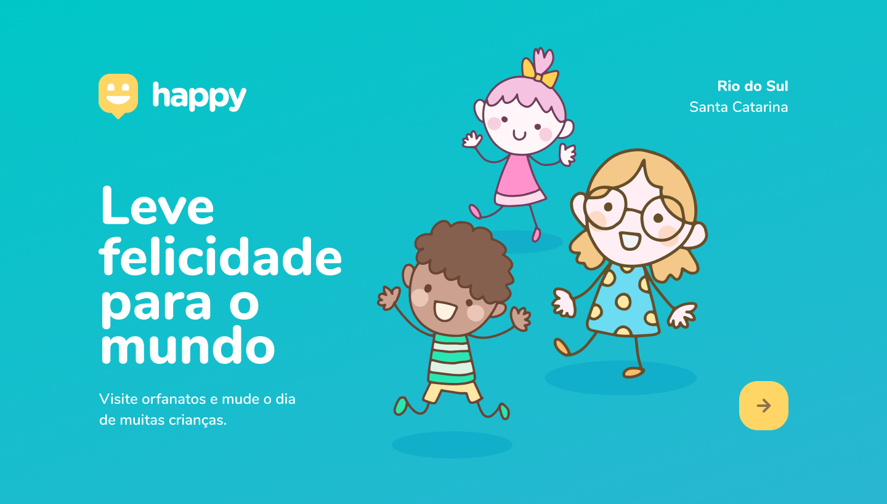

# Happy   :star2:

###### Uma solução que conecta você a crianças desabrigadas

*Seguindo a semana Next Level Week resolvi criar a aplicação junto com essa galera maravilhosa, só que dessa vez utilizei o Angular, aprendendo como funciona os módulos do Angular e o sistema de rotas, queria agradecer ao pessoal da rocketseat por acrescentar tantas coisas boas em minha vida*

*Construir algo que pode conectar pessoas facilitando a comunicação isso me fascina!*

## Web :computer:

  
    
  

